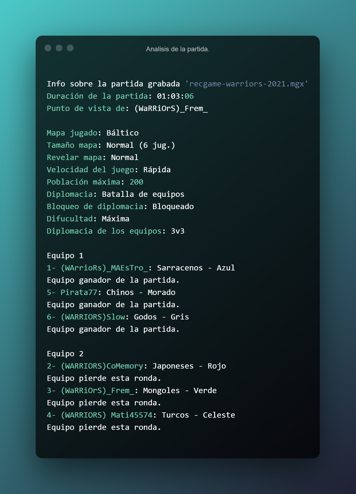

# AoE2 recgame info
Get important information about Age of Empires 2 recorded games.

## Description
Get important info about the recorded games like map, time played, teams, and many more.

## Dependencies
- [mgz](https://github.com/happyleavesaoc/aoc-mgz) (Also via pip: `pip install mgz`)

## Reason of the project
This project will be part of the Warriors Clan webpage, and will be merged with [AoE Minimap Generator](https://github.com/Marfullsen/AoE2-minimap-generator) to get something amazing like [RecGames.es](https://github.com/goto-bus-stop/recgames).

## Contributing
- Pull requests are welcome.

## Resources.
- Mgz [pypi.org/project/mgz/](https://pypi.org/project/mgz/)
- Mgz [github.com/happyleavesaoc/aoc-mgz](https://github.com/happyleavesaoc/aoc-mgz)
- RecAnalyst [github.com/goto-bus-stop/recanalyst](https://github.com/goto-bus-stop/recanalyst)
- RecGames [github.com/goto-bus-stop/recgames](https://github.com/goto-bus-stop/recgames)